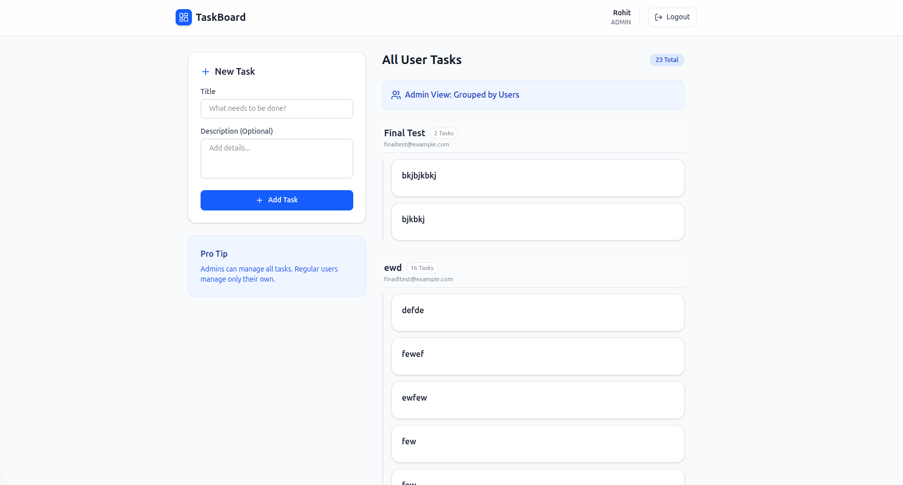

# 🚀 Full-Stack Task Management System

A robust Task Management application built with the **MERN Stack** (MongoDB, Express, React/Next.js, Node.js). It features role-based authentication (Admin vs. User), secure cookie-based sessions, and a fully responsive UI.

## 🛠️ Tech Stack

**Backend:**
- Node.js & Express.js
- MongoDB & Mongoose
- JWT (JSON Web Tokens) & HTTP-Only Cookies
- Bcrypt.js for Password Hashing

**Frontend:**
- Next.js 14 (App Router)
- Tailwind CSS (Styling)
- Lucide React (Icons)
- Axios (API Requests)
- Context API (State Management)

---

## ✨ Features

- **🔐 Authentication:** Secure Register/Login with HTTP-Only cookies.
- **🛡️ Role-Based Access:**
  - **User:** Can Create, Read, and Delete *only their own* tasks.
  - **Admin:** Can View *all* tasks (grouped by user) and Delete *any* task.
- **📱 Responsive Design:**
  - Sticky Sidebar for Desktop.
  - Floating Action Button (FAB) & Modal for Mobile.
- **⚡ UX Enhancements:** Skeleton loaders, password visibility toggle, and glassmorphism effects.

---

## 📂 Project Structure

```bash
/project-root
  ├── /client      # Next.js Frontend
  └── /server      # Node.js/Express Backend

🚀 Getting Started
1. Backend Setup (Server)
Navigate to the server folder and install dependencies:

cd server
npm install

Create a .env file in the server folder:

Code snippet

PORT=5000
MONGO_URI=mongodb://localhost:27017/taskmanager
JWT_SECRET=your_super_secret_key_here
NODE_ENV=development
Start the backend server:

Bash

npm run dev
# Server running on http://localhost:5000
2. Frontend Setup (Client)
Navigate to the client folder and install dependencies:

Bash

cd client
npm install
Create a .env.local file in the client folder:

Code snippet

NEXT_PUBLIC_API_URL=http://localhost:5000/api
Start the frontend server:

Bash

npm run dev
# App running on http://localhost:3000
👨‍💻 Usage Guide
Creating an Admin User
By default, all new users are registered with the role "USER". To create an Admin:

1. Register a new user via the signup page.

2.Open MongoDB Compass.

3.Navigate to the users collection.

4.Find the user and manually change the role field from "USER" to "ADMIN".

5.Re-login to see the Admin Dashboard.

API Endpoints

Method,Endpoint,Description,Access
POST,/api/auth/register,Register new user,Public
POST,/api/auth/login,Login user,Public
GET,/api/tasks,Get tasks (Own or All),Private
POST,/api/tasks,Create a task,Private
DELETE,/api/tasks/:id,Delete task,Owner/Admin

## 📸 Screenshots

### Login Page


### Dashboard (Desktop)


### Mobile View
